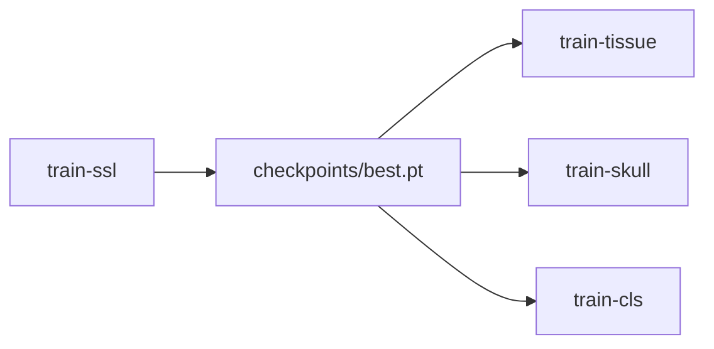

# Autoencoder ver3 — MAE/VAE SSL + Downstream Tasks

ver3 extends ver2 with downstream finetuning parity to `swin_unet` ver4.

## CLI

```bash
python -m autoencoder.src.ver3.cli <command> [args...]
```

| Command | Alias | Description |
|---|---|---|
| `train-ssl` | `train` | SSL pretrain (MAE or VAE) |
| `eval-ssl` | `eval` | Evaluate SSL checkpoint |
| `train-tissue` | `tissue` | Multi-class tissue segmentation |
| `train-skull` | `skull` | Supervised skull stripping (binary mask) |
| `train-cls` | `cls` | Alzheimer MRI classification |

## Workflow

1. **Pretrain** encoder with `train-ssl` (MAE or VAE).
2. **Finetune** downstream with `--resume-ckpt` and `--ckpt-load-mode encoder_only` (or `full`).



## Example: SSL pretrain (MAE)

```bash
python -m autoencoder.src.ver3.cli train-ssl \
  --data-root /path/to/IXI-T1 \
  --mae \
  --image-size 256 \
  --plane axial \
  --epochs 150 \
  --batch-size 32 \
  --dual-view \
  --out-dir runs/mae_ssl \
  --run-name exp1 \
  --amp
```

## Example: Tissue segmentation from MAE ckpt

```bash
python -m autoencoder.src.ver3.cli train-tissue \
  --mae \
  --image-size 256 \
  --train-root /path/to/images/train \
  --eval-root /path/to/images/eval \
  --train-label /path/to/labels/train \
  --eval-label /path/to/labels/eval \
  --train-list /path/to/scans_test.txt \
  --eval-list /path/to/scans_valid.txt \
  --seg-labels autoencoder/src/ver3/tissue_segmentation/txt/seg_labels.txt \
  --label-mode 1 \
  --resume-ckpt runs/mae_ssl/exp1/checkpoints/best.pt \
  --ckpt-load-mode encoder_only \
  --epochs 200 \
  --batch-size 32 \
  --out-dir runs/tissue_mae \
  --run-name exp1 \
  --amp
```

Use `--vae` instead of `--mae` for VAE backbone.

## Example: Skull stripping

```bash
python -m autoencoder.src.ver3.cli train-skull \
  --vae \
  --train_dir /path/to/train_png_masks \
  --val_dir /path/to/val_png_masks \
  --image-size 256 \
  --resume-ckpt runs/vae_ssl/exp1/checkpoints/best.pt \
  --ckpt-load-mode encoder_only \
  --epochs 100 \
  --batch-size 16 \
  --out-dir runs/skull_vae \
  --run-name exp1 \
  --amp
```

## Example: Alzheimer classifier

```bash
python -m autoencoder.src.ver3.cli train-cls \
  --mae \
  --image_size 256 \
  --resume-ckpt runs/mae_ssl/exp1/checkpoints/best.pt \
  --ckpt-load-mode encoder_only \
  --classification_mode classification_bottleneck_concat \
  --epochs 20 \
  --batch_size 32 \
  --out_dir runs/alzheimer_mae
```

Classifier supports `classification_default` and `classification_bottleneck_concat` only (bottleneck features from MAE/VAE encoder).

## Checkpoint loading

| `--ckpt-load-mode` | Behavior |
|---|---|
| `none` | Train from scratch |
| `encoder_only` | Load `encoder_state_dict_prefixes()` only |
| `full` | Load full `model` state (strict=False if head changed) |

**MAE** encoder prefixes: `patch_encoder`, `pos_embed`  
**VAE** encoder prefixes: `encoder`, `mu_head`, `logvar_head`

## MAE vs VAE downstream

| Task | MAE output head | VAE output head |
|---|---|---|
| Tissue / Skull | `recon_head` (Conv2d) | `decoder.out_conv` |
| Classifier | GAP on `encode_bottleneck()` | GAP on conv bottleneck |

Downstream tasks use **no pixel masking** (`pixel_mask=None`) during finetune.

## Package layout

```
autoencoder/src/ver3/
  cli.py
  main.py, eval.py, trainer.py   # SSL (from ver2)
  downstream/                    # shared finetune helpers
  tissue_segmentation/
  skull_stripping/
  alzheimer_classifier/
  models/                        # MAEDualViewSSL, VAEDualViewSSL
```

ver2 is unchanged for backward compatibility.
